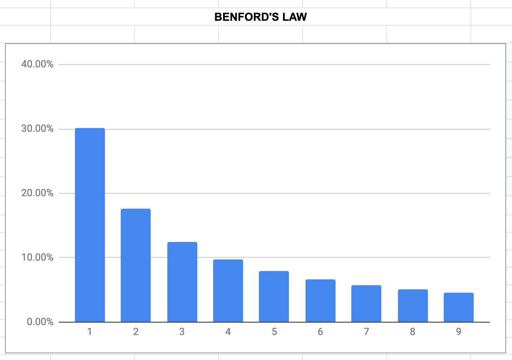
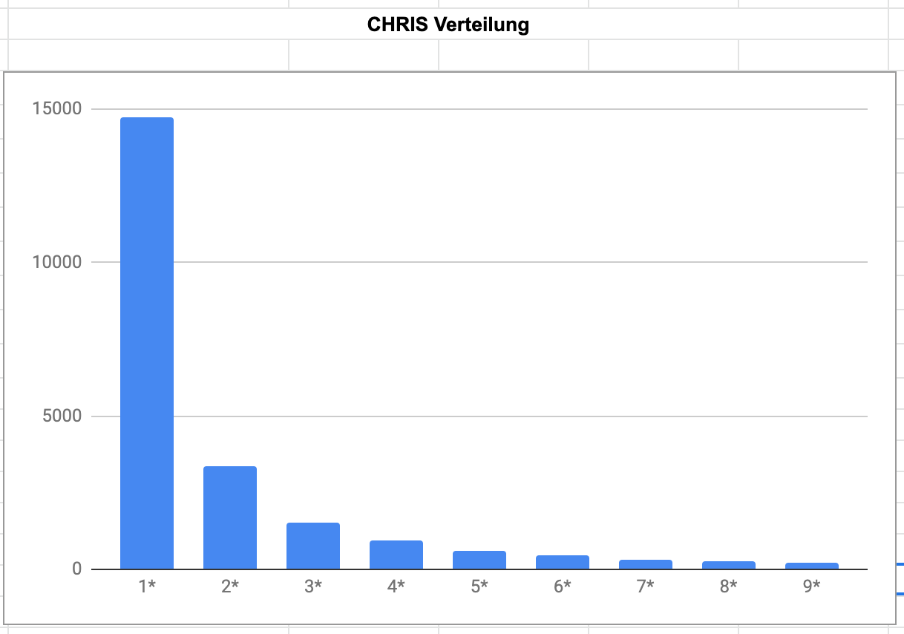

# Lobhudelei

Daten in Sheets
https://docs.google.com/spreadsheets/d/199jbnMLkGPOyMxQPM4tKSVIgNFXk2aAaYhk9daYIZkQ/edit?usp=sharing

Insgesamt wörter geschrieben:	130988 wörter (144 Artikel)

Unterschiedliche Wörter	22429

häufigstes wort	die (4111)

erster artikel	11.7.2018 (890 Tage)

Wörter pro Tag	147.1775281

	
Seltene wörter (<5)	19048

Einzigartige wörter	13801 > anteilig	61.53%
	
	
Längstes Wort	"Eine-Milliarde-Nutzer:innen-Schallmauer"
	https://netzpolitik.org/2019/gute-laune-und-zensur
	(DachwitzShownotes:Verhandlungsgliederung)
	
Informationen	128

Daten	360

TikTok	339

App	355

Twitter	146

Frauen	146

Männer	25

Instagram	32

ByteDance	43

Algorithmen	60

Deutschland	206

Facebook	201

Hass	15

Podcast	31

### Benford's Law

Hintergrund:	https://www.wnycstudios.org/podcasts/radiolab/articles/breaking-benford

